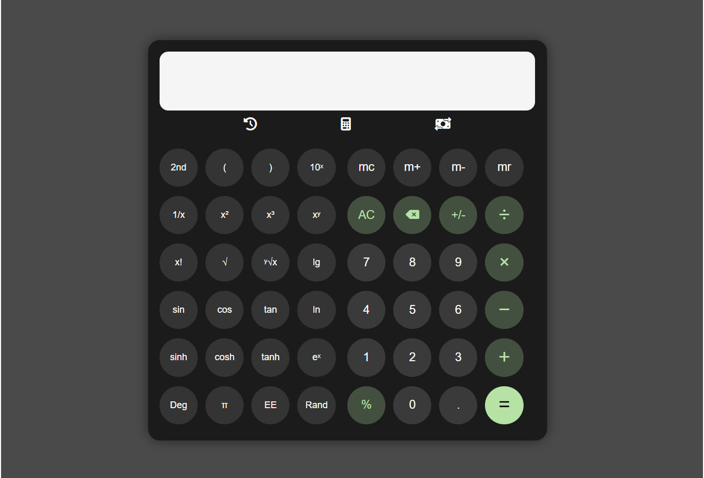

# Smart Calculator

A web-based calculator application built using HTML, CSS, and JavaScript. The project provides a clean and interactive interface for performing basic mathematical operations.

## Features

- Basic calculator operations:
  - Addition
  - Subtraction
  - Multiplication
  - Division
  - Percentage calculation
  - All clear
  - Delete last Digit
  - change positive number to negative and vice verse
  - decimal operation

- User-friendly calculator interface
- Responsive design
- Button-based input system

## Upcoming Features

The following features are currently under development:

- Scientific calculator functions
- Currency converter
- Calculation history 

## Technologies Used

- HTML
- CSS
- JavaScript
- Font Awesome Icons

## Project Status

The basic calculator functionality is completed. Scientific mode, currency conversion, and history features are being improved and will be added in future updates.

## Future Improvements

- Add complete scientific calculations
- Add real-time currency conversion
- Add calculation history storage
- Improve UI and user experience
